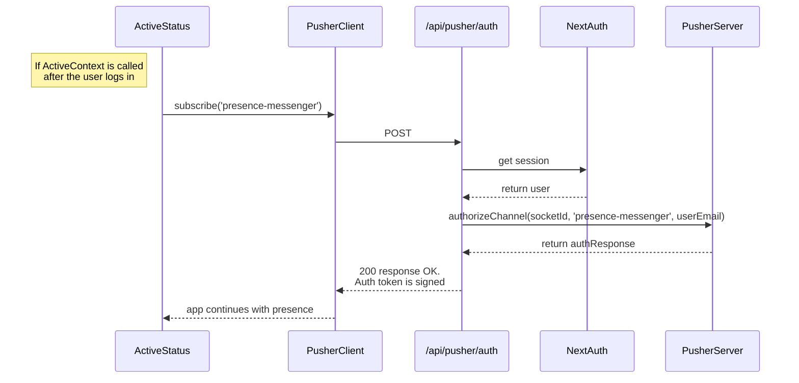
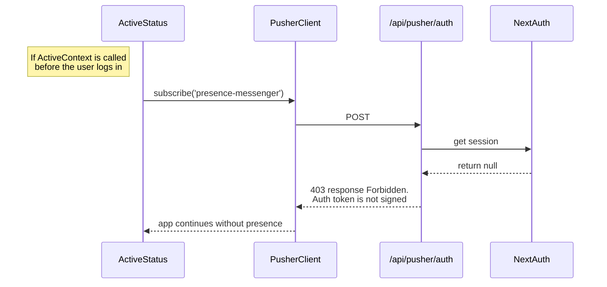

# Here is how Pusher works:
  
Only when the user is logged in, the app loads the context `ActiveStatus` and calls the hook `useActiveChannel` ([context](/app/components/ActiveStatus.tsx), [hook](/app/hooks/useActiveChannel.ts)).

In the hook, `PusherClient` subscribes to `"prescence-messenger"` and in doing so asks for an auth token at `/api/pusher/auth` ([api route](/app/api/pusher/auth/route.ts)).

`PusherServer` signs the request for `PusherClient` and passes the data for the user only if the user is logged in (hence the requirement that the context cannot be called at root layout). If the user is not logged in, `PusherClient`'s auth token recieves a 403 `Forbidden` response and the presence channel is not created.

From here, the presence channel must listen to `pusher:subscription_succeeded`, `pusher:member_added`, `pusher:member_removed` so the app has a copy of the present members. Now, the app can get a copy of the members with the hook `useActiveList` ([hook](/app/hooks/useActiveList.ts)).
  

### Caution

If the `ActiveContext` is called at the root layout before the user has logged in, `PusherClient`'s auth token will NOT get signed by `PusherServer`. The app will remain the same but continue without presence channels. To mitigate this, there is a check for the current user in the hook ([here](/app//hooks/useActiveChannel.ts)).

