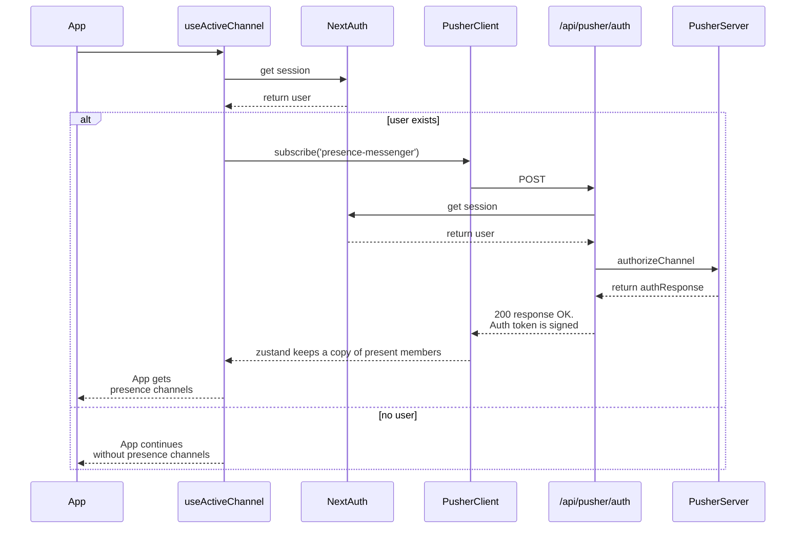
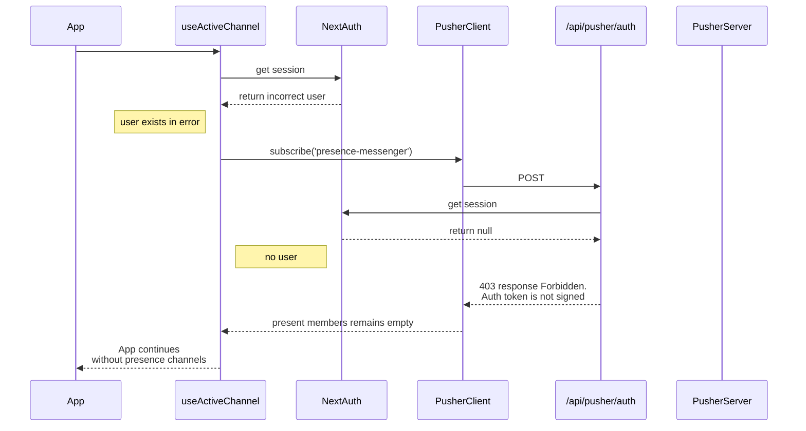

# Here is how Pusher works:
  
The app loads the context `ActiveStatus` and calls the hook `useActiveChannel` ([context](/app/context/PresenceContext.tsx), [hook](/app/hooks/useActiveChannel.ts)).

If the user is logged in, `PusherClient` subscribes to `"presence-messenger"` and in doing so asks for an auth token at `/api/pusher/auth` ([api route](/app/api/pusher/auth/route.ts), [client object](/app/libs/pusher.ts)).

`PusherServer` signs the request for `PusherClient` and passes the data for the user only if the user is logged in. If the user is not logged in, `PusherClient`'s auth token recieves a 403 `Forbidden` response and the presence channel is not created.

From here, the presence channel must listen to `pusher:subscription_succeeded`, `pusher:member_added`, `pusher:member_removed` so the app has a copy of the present members. Now, the app can get a copy of the members with the hook `useActiveList` ([hook](/app/hooks/useActiveList.ts)).
  

### Notice

If the user has not logged in, `PusherClient` won't subscribe to `"presence-messenger"`. Now if somehow `PusherClient` subscribes incorrectly from the frontend, the requested auth token will NOT get signed by `PusherServer` because of backend validation. For example:

